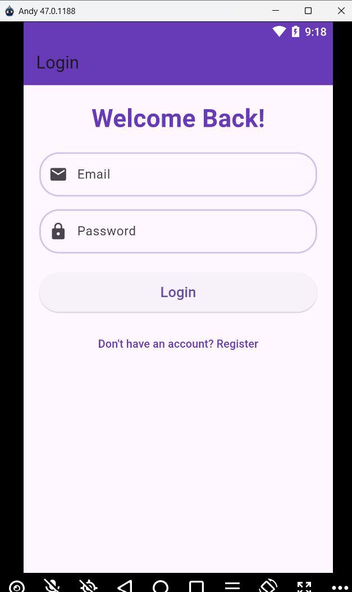
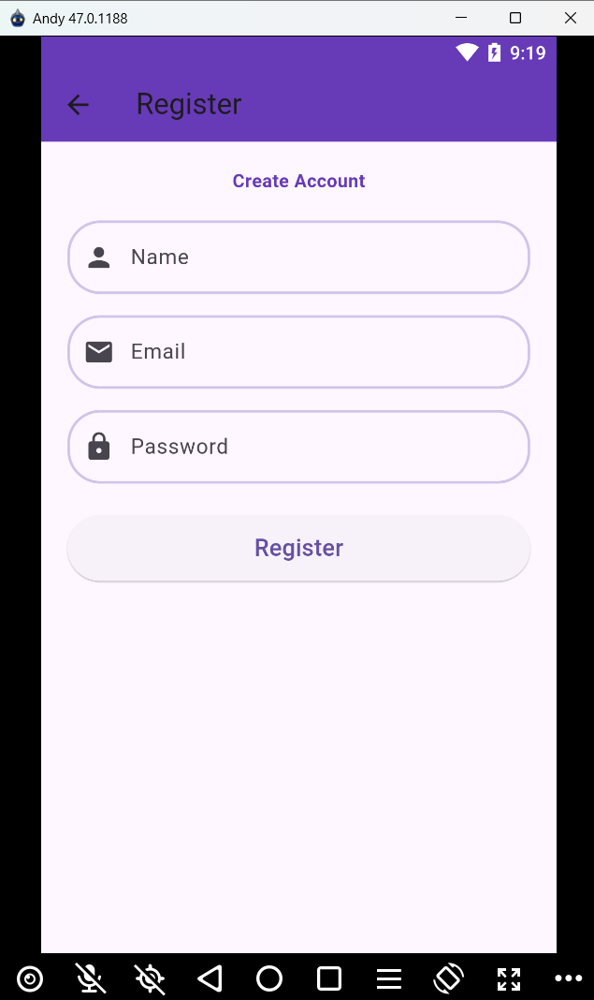
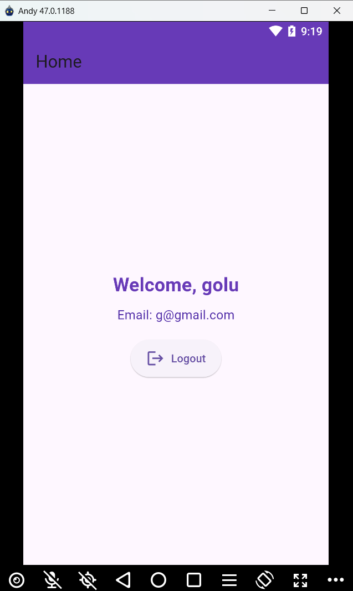

Sure! Here's a ready-to-use `README.md` format that you can copy and paste directly into your project.
# DEMO
## LOGIN 
 
## REGISTER
 
## HOME PROTECTED ROUTE
 

# Flutter BLoC Example

This repository demonstrates the usage of the **Flutter BLoC** package to manage state and events in a Flutter app. The BLoC pattern helps separate business logic from UI, improving code maintainability, testability, and scalability.

## Table of Contents
- [What is BLoC?](#what-is-bloc)
- [How to Install](#how-to-install)
- [BLoC Basics](#bloc-basics)
  - [Creating Events](#creating-events)
  - [Creating States](#creating-states)
  - [Creating a BLoC](#creating-a-bloc)
- [Working with Models](#working-with-models)
  - [Model Creation](#model-creation)
  - [Serialization & Deserialization](#serialization--deserialization)
- [Example Project](#example-project)
- [Conclusion](#conclusion)

---

# What is BLoC?

**BLoC** stands for **Business Logic Component**. It is an architectural pattern that uses **Streams** to manage state and events. In Flutter, the `flutter_bloc` package provides an easy-to-use API to implement BLoC. The pattern helps separate the UI from the business logic, leading to better scalability and testability of your application.

### Core Concepts:
- **Events**: Actions that trigger the BLoC to change states.
- **States**: Data that the BLoC emits to represent the UI state.
- **BLoC**: The component that processes events and emits states.

---

## How to Install

To get started, add the `flutter_bloc` package to your `pubspec.yaml` file:

```yaml
dependencies:
  flutter:
    sdk: flutter
  flutter_bloc: ^8.0.0  # Use the latest version
```

Then run the following command to install the dependencies:

```bash
flutter pub get
```

---

## BLoC Basics

### Creating Events

Events represent user actions or triggers that the BLoC will react to. Here's an example of defining events for authentication:

```dart
// auth_event.dart
abstract class AuthEvent {}

class AuthLoginRequested extends AuthEvent {
  final String email;
  final String password;

  AuthLoginRequested({required this.email, required this.password});
}

class AuthLogoutRequested extends AuthEvent {}
```

### Creating States

States represent the different UI states of your application. Here's an example of defining authentication-related states:

```dart
// auth_state.dart
abstract class AuthState {}

class AuthInitial extends AuthState {}

class AuthLoading extends AuthState {}

class AuthLoggedIn extends AuthState {
  final String userEmail;

  AuthLoggedIn({required this.userEmail});
}

class AuthError extends AuthState {
  final String error;

  AuthError({required this.error});
}

class AuthLoggedOut extends AuthState {}
```

### Creating a BLoC

A **BLoC** contains the business logic and reacts to incoming events, emitting states accordingly:

```dart
// auth_cubit.dart
import 'package:flutter_bloc/flutter_bloc.dart';
import 'auth_event.dart';
import 'auth_state.dart';

class AuthCubit extends Cubit<AuthState> {
  AuthCubit() : super(AuthInitial());

  void loginUser(String email, String password) async {
    emit(AuthLoading());
    try {
      // Simulate a login request
      await Future.delayed(Duration(seconds: 2));
      if (email == 'test@test.com' && password == 'password123') {
        emit(AuthLoggedIn(userEmail: email));
      } else {
        emit(AuthError(error: 'Invalid credentials.'));
      }
    } catch (e) {
      emit(AuthError(error: e.toString()));
    }
  }

  void logoutUser() {
    emit(AuthLoggedOut());
  }
}
```

---

## Working with Models

### Model Creation

A **Model** represents the data structure. In Flutter, a `User` model might look like this:

```dart
// user.dart
class User {
  final String name;
  final String email;

  User({required this.name, required this.email});

  // Deserialization (JSON to User object)
  factory User.fromJson(Map<String, dynamic> json) {
    return User(
      name: json['name'],
      email: json['email'],
    );
  }

  // Serialization (User object to JSON)
  Map<String, dynamic> toJson() {
    return {
      'name': name,
      'email': email,
    };
  }
}
```

### Serialization & Deserialization

**Serialization** converts a model object into a JSON object, while **deserialization** converts JSON data into a model object.

#### Example of Deserialization:

```dart
Map<String, dynamic> userJson = {
  'name': 'John Doe',
  'email': 'john.doe@example.com',
};

User user = User.fromJson(userJson);
```

#### Example of Serialization:

```dart
User user = User(name: 'John Doe', email: 'john.doe@example.com');
Map<String, dynamic> userJson = user.toJson();
```

These methods are useful for saving and retrieving data from APIs or local storage.

---

## Example Project

Here is a simple example of using **Flutter BLoC** for authentication:

```dart
// main.dart
import 'package:flutter/material.dart';
import 'package:flutter_bloc/flutter_bloc.dart';
import 'auth_cubit.dart';
import 'auth_state.dart';
import 'auth_event.dart';

void main() {
  runApp(MyApp());
}

class MyApp extends StatelessWidget {
  @override
  Widget build(BuildContext context) {
    return MaterialApp(
      home: BlocProvider(
        create: (_) => AuthCubit(),
        child: LoginPage(),
      ),
    );
  }
}

class LoginPage extends StatelessWidget {
  final TextEditingController emailController = TextEditingController();
  final TextEditingController passwordController = TextEditingController();

  @override
  Widget build(BuildContext context) {
    return Scaffold(
      appBar: AppBar(title: Text("Login")),
      body: BlocListener<AuthCubit, AuthState>(
        listener: (context, state) {
          if (state is AuthLoggedIn) {
            ScaffoldMessenger.of(context).showSnackBar(SnackBar(
                content: Text('Welcome, ${state.userEmail}')));
          } else if (state is AuthError) {
            ScaffoldMessenger.of(context).showSnackBar(SnackBar(
                content: Text('Error: ${state.error}')));
          }
        },
        child: Padding(
          padding: const EdgeInsets.all(16.0),
          child: Column(
            children: [
              TextField(
                controller: emailController,
                decoration: InputDecoration(labelText: 'Email'),
              ),
              TextField(
                controller: passwordController,
                decoration: InputDecoration(labelText: 'Password'),
                obscureText: true,
              ),
              ElevatedButton(
                onPressed: () {
                  context.read<AuthCubit>().loginUser(
                        emailController.text,
                        passwordController.text,
                      );
                },
                child: Text('Login'),
              ),
            ],
          ),
        ),
      ),
    );
  }
}
```

---

## Conclusion

Using **Flutter BLoC** makes it easier to manage the state and events of your app in a scalable and maintainable way. It decouples your business logic from the UI, making your app easier to test and extend.

By working with **models**, and applying **serialization** and **deserialization**, you can seamlessly handle complex data exchanges, whether for local storage or interacting with APIs.

For more information, check out the official [Flutter BLoC documentation](https://pub.dev/packages/flutter_bloc).

